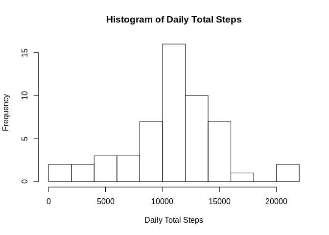
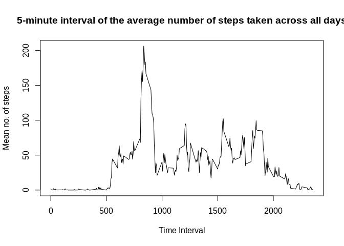
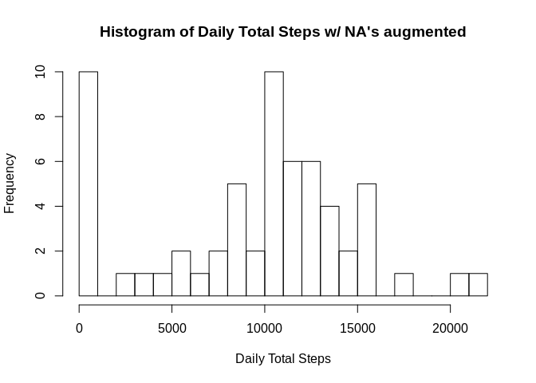
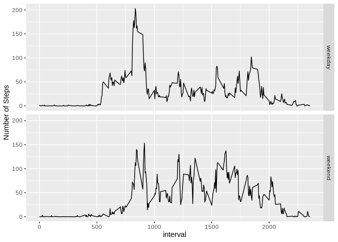

### Loading and preprocessing the data


```r
library(ggplot2)
data <- read.csv("./activity.csv", header = T, sep = ",")
data$date <- as.POSIXct(data$date)
```

### Q1 What is mean total number of steps taken per day?

##### Q1.1 Calculate the total number of steps taken per day


```r
dailyTotal <- aggregate(steps ~ date,data, sum)
head(dailyTotal)
```

```
##         date steps
## 1 2012-10-02   126
## 2 2012-10-03 11352
## 3 2012-10-04 12116
## 4 2012-10-05 13294
## 5 2012-10-06 15420
## 6 2012-10-07 11015
```

##### Q1.2 Make a histogram of the total number of steps taken each day


```r
 hist(dailyTotal$steps, xlab = "Daily Total Steps", main = "Histogram of Daily Total Steps", breaks=10)
```

<!-- -->

##### Q1.3 Calculate and report the mean and median of the total number of steps taken per day


```r
mean(dailyTotal$steps)
```

```
## [1] 10766.19
```


```r
median(dailyTotal$steps)
```

```
## [1] 10765
```


### Q2 What is the average daily activity pattern?

##### Q2.1 Make a time series plot (i.e. type="l") of the 5-minute interval (x-axis) and the average number of steps taken, averaged across all days (y-axis)


```r
intervalMean <- aggregate(steps ~ interval,data, mean, na.rm=TRUE)
plot(intervalMean$interval, intervalMean$steps,type="l", ylab="Mean no. of steps", xlab="Time Interval", main= "5-minute interval of the average number of steps taken across all days")
```

<!-- -->

##### Q2.2 Which 5-minute interval, on average across all the days in the dataset, contains the maximum number of steps?


```r
intervalMean[which.max(intervalMean$steps),]
```

```
##     interval    steps
## 104      835 206.1698
```


### Q3 Inputing missing values

##### Q3.1 Calculate and report the total number of missing values in the dataset (i.e. the total number of rows with NAs)


```r
emptyData <- subset(data, is.na(steps))
length(emptyData$steps)
```

```
## [1] 2304
```

##### Q3.2 Devise a strategy for filling in all of the missing values in the dataset. The strategy does not need to be sophisticated. For example, you could use the mean/median for that day, or the mean for that 5-minute interval, etc.


```r
#Use the median of all activity
meanSteps <- median(data$steps, na.rm=TRUE)
```

##### Q3.3 Create a new dataset that is equal to the original dataset but with the missing data filled in.


```r
appendedData <- data
appendedData$steps[is.na(appendedData$steps)] <- median(appendedData$steps, na.rm = T)
subset(appendedData, is.na(steps))
```

```
## [1] steps    date     interval
## <0 rows> (or 0-length row.names)
```

##### Q3.4 Make a histogram of the total number of steps taken each day and Calculate and report the mean and median total number of steps taken per day. Do these values differ from the estimates from the first part of the assignment? What is the impact of imputing missing data on the estimates of the total daily number of steps?


```r
dailyTotalAppended <- aggregate(steps ~ date,appendedData, sum)

hist(dailyTotalAppended$steps, xlab = "Daily Total Steps", main = "Histogram of Daily Total Steps w/ NA's augmented", breaks=20)
```

<!-- -->

```r
mean(dailyTotalAppended$steps)
```

```
## [1] 9354.23
```

```r
median(dailyTotalAppended$steps)
```

```
## [1] 10395
```


### Q4 Are there differences in activity patterns between weekdays and weekends?

##### Q4.1 Create a new factor variable in the dataset with two levels – “weekday” and “weekend” indicating whether a given date is a weekday or weekend day.


```r
appendedData$week <- ifelse(weekdays(appendedData$date) == "Saturday" | weekdays(appendedData$date) == "Sunday" ,"weekend","weekday")
head(appendedData)
```

```
##   steps       date interval    week
## 1     0 2012-10-01        0 weekday
## 2     0 2012-10-01        5 weekday
## 3     0 2012-10-01       10 weekday
## 4     0 2012-10-01       15 weekday
## 5     0 2012-10-01       20 weekday
## 6     0 2012-10-01       25 weekday
```

##### Q4.2 Make a panel plot containing a time series plot (i.e. type="l") of the 5-minute interval (x-axis) and the average number of steps taken, averaged across all weekday days or weekend days (y-axis).


```r
appendedDataPlot <- aggregate(steps ~ interval + week,appendedData, mean)

ggplot(data=appendedDataPlot, aes(x=interval, y=steps)) + ylab("Number of Steps") + geom_line() + facet_grid(week~.)
```

<!-- -->


